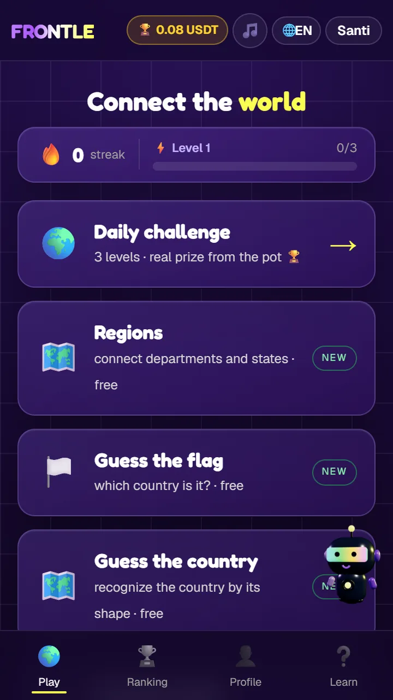
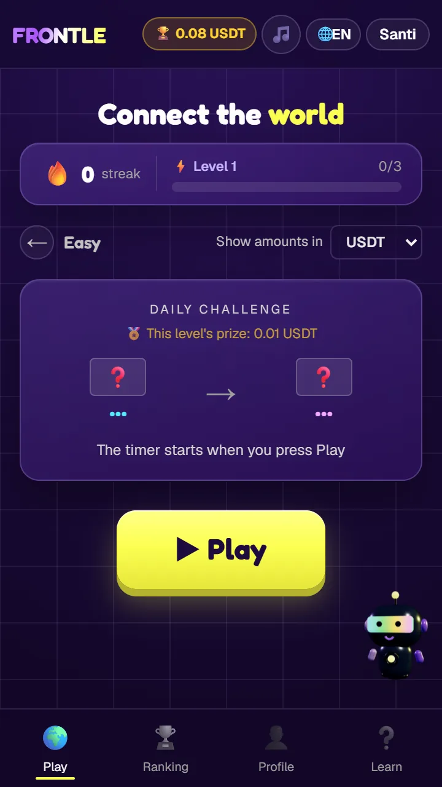
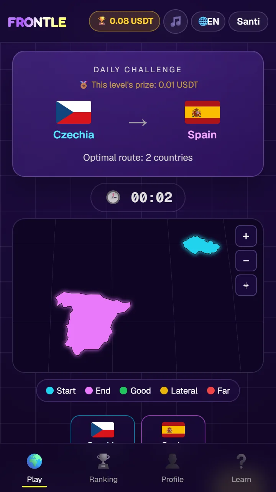
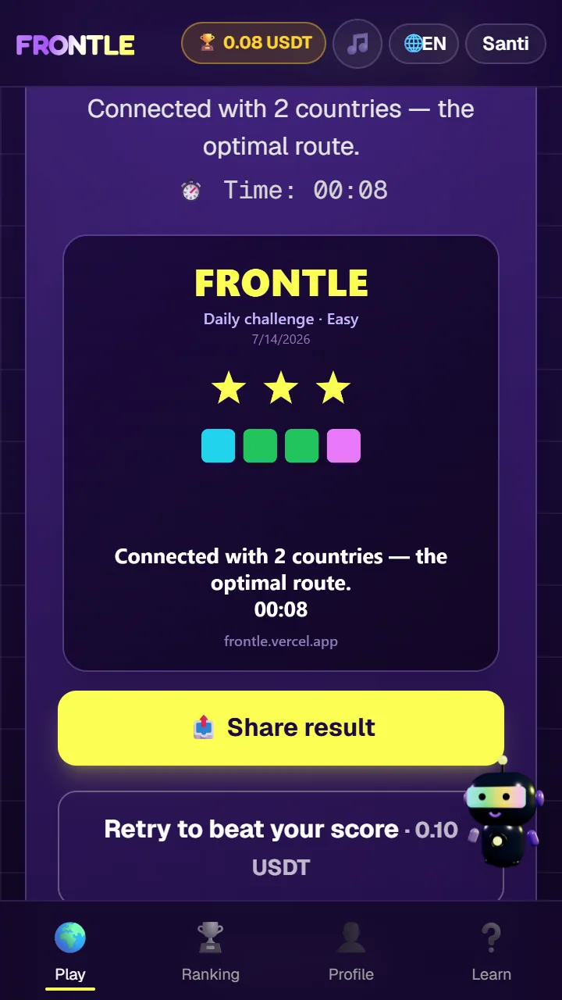
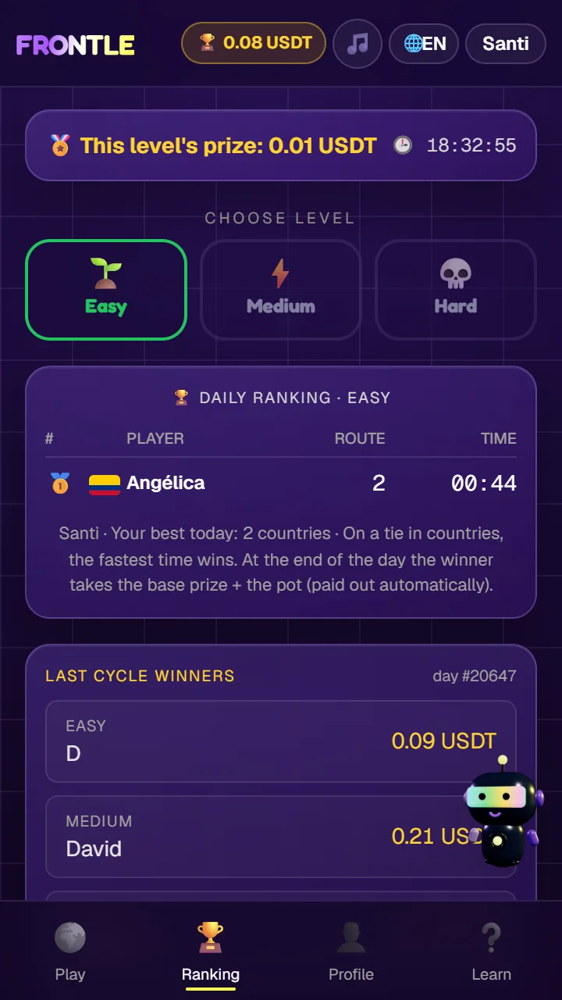
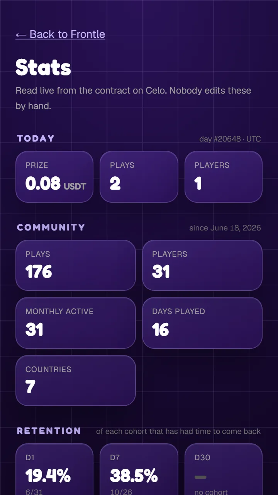
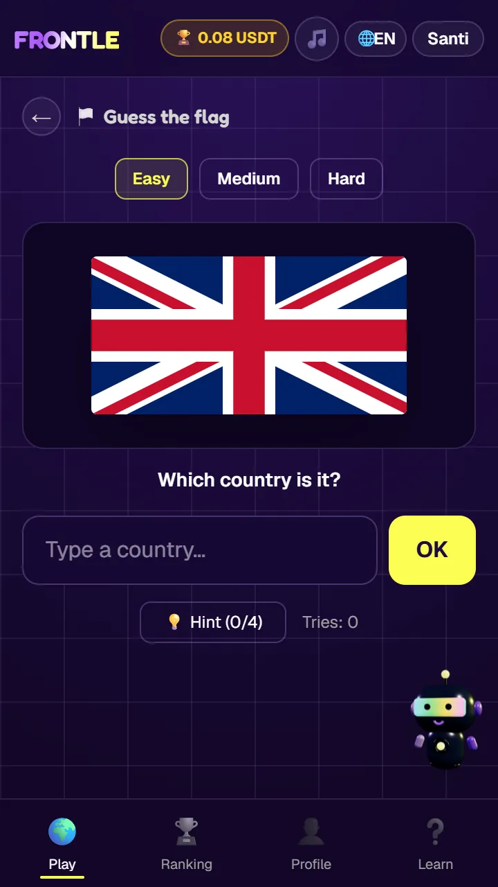
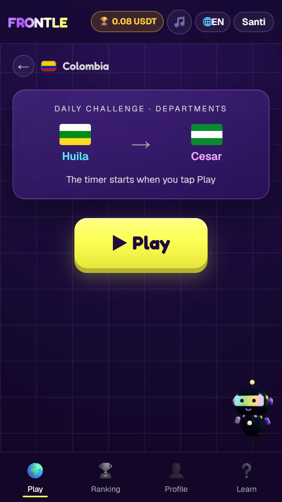

# 🌍 Frontle

> **Conecta el mundo por sus fronteras.** El Wordle de geografía, dentro de MiniPay, con premios reales en stablecoins sobre Celo.

Frontle es un juego de geografía **diario** inspirado en [Travle](https://travle.earth): cada día, el mismo reto para todo el mundo — un país de **origen** y uno de **destino**. Tienes que unirlos listando los países intermedios que comparten frontera terrestre. **Menos países = mejor puntaje;** a igualdad de países, gana quien lo resuelve en menos tiempo.

Construido para **[MiniPay](https://www.opera.com/products/minipay)** (16M+ usuarios) sobre **[Celo](https://celo.org)**. Está **en producción, con usuarios y dinero real**, y compite en **Proof of Ship**, el programa mensual de builders de Celo.

| | |
|---|---|
| 🎮 **App en vivo** | **https://frontle.vercel.app** |
| 📊 **Estadísticas públicas** | [frontle.vercel.app/stats](https://frontle.vercel.app/stats) — leídas del contrato, nadie las edita a mano |
| ⛓️ **Contrato v2** (niveles, verificado) | [`0xaDcA…BeBE`](https://celo.blockscout.com/address/0xaDcA9A707F394509C8aA906B89B93cb222f2BeBE) |
| ⛓️ **Contrato v1** (histórico) | [`0x7Ea1…Fa09`](https://celo.blockscout.com/address/0x7Ea1EEB96Caf0b07E47354c349b8FdFC75B2Fa09) |

---

## 📱 Así se ve

| Inicio | Reto del día | Partida |
|---|---|---|
|  |  |  |
| Los modos disponibles, tu racha y tu nivel de XP. | El reto es **el mismo para todo el mundo** ese día. Aquí, el nivel fácil. | El mapa se pinta a medida que aciertas: el semáforo te dice si acercas, vas de lado o te alejas. |

| Resuelto | Ranking | Estadísticas |
|---|---|---|
|  |  |  |
| Estrellas, tiempo y una **tarjeta compartible** tipo Wordle que no revela la solución. | Ranking del día por nivel + los ganadores del ciclo anterior con su premio. | La página `/stats`, leída en vivo del contrato y de Supabase. |

---

## 🎮 Modos de juego

### Reto diario — *3 niveles, premio real*

El corazón del juego. Cada día hay **tres retos independientes**, uno por dificultad, cada uno con su propio ranking y su propia parte del pot:

| Nivel | Cómo se elige el reto |
|---|---|
| 🌱 **Fácil** | Países muy reconocibles (set curado). |
| ⚡ **Medio** | El resto, partido por conectividad: los más conectados. |
| 💀 **Difícil** | Los más aislados del grafo — cadenas largas y traicioneras. |

El reto es **determinista por fecha UTC**: todo el mundo juega exactamente lo mismo, sin servidor que lo reparta.

### Otros modos — *gratis, sin wallet*

| Modo | Qué es |
|---|---|
| 🗺️ **Regiones** | El mismo juego pero **dentro de un país**: conecta departamentos y estados. Disponibles Colombia, Estados Unidos, Argentina, Brasil, Nigeria y Ghana. |
| 🏳️ **Adivina la bandera** | ¿De qué país es esta bandera? Con pistas escalonadas (continente, cuántos vecinos, inicial…). |
| 🗿 **Adivina el país** | Lo mismo, pero reconociendo el país **por su silueta**. |
| 🎯 **Práctica** | Retos ilimitados del juego principal, sin pagos ni ranking. Para entrenar. |

 

---

## 💰 Modelo económico (on-chain, en Celo)

| Acción | Precio |
|---|---|
| **Primer intento del día** | **Gratis** |
| Reintento (mejorar tu marca) | 0.10 USDT |
| Pista — inicial del siguiente país | 0.05 USDT |
| Pista — silueta del siguiente país | 0.05 USDT |
| Pista — silueta de todos los países | 0.10 USDT |

Cada pago se reparte **80% al pot del día / 20% al protocolo** (`protocolBps = 2000` en el contrato). La plataforma además **siembra un premio base** con `fundPot`.

Al cerrar el día (UTC), el pot se **reparte entre los ganadores de los tres niveles**:

| Ganadores del día | Difícil | Medio | Fácil |
|---|---|---|---|
| Los tres niveles | 50% | 35% | 15% |
| Falta el fácil | 50% | 50% | — |
| Falta el medio | 85% | — | 15% |
| Falta el difícil | — | 75% | 25% |
| Un solo nivel | 100% a ese | | |

La regla de fondo: la parte de un nivel sin ganador **sube al nivel inmediatamente más difícil** que sí lo tenga. Si no gana nadie, el pot queda sin repartir y solo el `owner` puede recuperarlo.

**Pagos sin fricción:** todo va vía MiniPay con *fee abstraction* (**CIP-64**) — el usuario paga la comisión de red en USDT y **nunca ve CELO**.

---

## 🏗️ Arquitectura

Monorepo. Todo el ciclo de juego → pago → premio está en producción.

```
frontle/
├── frontend/         # Next.js 16 — el juego (WebView de MiniPay) + toda la lógica
├── supabase/         # Ranking, ganadores y cierre diario (Edge Function + cron)
├── contracts/        # FrontleGame en Celo (Foundry) — pagos, pot y reclamos
└── packages/borders/ # @frontle/borders — el motor de fronteras, como paquete npm
```

### El día de un jugador

```
   Jugador                MiniPay / Celo                 Supabase
   ───────                ──────────────                 ────────
   juega y paga  ──▶  payAttempt / buyHint  ──▶  +80% pot   submitScore (ranking)
   pista/reintento     (USDT, sin CELO a la vista)
                                                  ┌──────────────────────────────┐
   00:10 UTC (cron) ─────────────────────────────│ Edge Function `close-day`    │
                                                  │ 1. lee los ganadores por     │
                                                  │    nivel del ranking         │
                                                  │ 2. rollDay(día, ganadores)   │── on-chain
                                                  │ 3. registra en `winners`     │
                                                  └──────────────────────────────┘
   ganador abre app ──▶ "Reclamar premio" ──▶ claim(día, nivel) ──▶ recibe su parte
```

- **`frontend/`** — Next.js + TypeScript + Tailwind v4 + viem. El grafo de fronteras, el BFS de ruta óptima, el reto determinista por fecha y la i18n son **lógica pura** en `app/lib/`, sin React ni DOM. Dentro de MiniPay la wallet se conecta **sola**, sin botón y sin librerías de conexión.
- **`supabase/`** — tabla `scores` (ranking diario por nivel), tabla `winners`, y la Edge Function **`close-day`**: un oráculo que una vez al día lee a los ganadores del ranking y los graba on-chain con `rollDay` para habilitar sus reclamos. La fuente de verdad del premio **siempre es el contrato**.
- **`contracts/`** — `FrontleGame` en Celo Mainnet, verificado. Maneja `payAttempt` / `buyHint`, el pot diario, `rollDay` (solo el operador) y `claim(día, nivel)`. Ver [`contracts/README.md`](contracts/README.md).
- **`packages/borders/`** — el motor extraído como paquete reutilizable: el grafo de fronteras terrestres, `shortestPath` y el generador de retos deterministas. Sin dependencias, sin DOM.

---

## 🌐 Idiomas

Cuatro: **español, inglés, portugués y francés** — los mercados de Celo/MiniPay. Los nombres de países **no están traducidos a mano**: salen de `Intl.DisplayNames` a partir del código ISO, así que añadir un país no cuesta ni una traducción.

---

## 📦 Stack

- **Frontend:** Next.js 16 · TypeScript · Tailwind CSS v4 · `viem`
- **Mapa:** `d3-geo` + `topojson-client`
- **Backend:** Supabase (Postgres + RLS, Edge Functions en Deno, `pg_cron` + `pg_net`)
- **Blockchain:** Celo Mainnet · USDT (6 dec) con adapter de `feeCurrency` (CIP-64)
- **Wallet:** MiniPay (`window.ethereum`, sin librerías de conexión) · Privy para quien llega sin wallet
- **Deploy:** Vercel (auto-deploy desde `main`)

---

## 🚀 Desarrollo

```bash
cd frontend
npm install
npm run dev                        # http://localhost:3000
npm run build
npx tsc --noEmit -p tsconfig.json  # este es el gate de verdad
```

Para probar **dentro de MiniPay** hace falta un dispositivo físico + ngrok (los emuladores no funcionan). El juego es completamente jugable en un navegador normal; lo que necesita MiniPay es la capa de pagos.

**Backend (Supabase):** las migraciones de `supabase/migrations/` crean `winners` y el cron diario; la Edge Function `close-day` se despliega aparte. Necesita los secrets `OPERATOR_PRIVATE_KEY`, `GAME_ADDRESS` y (opcional) `CELO_RPC_URL`.

---

## ✅ Estado

- [x] Juego completo: mapa, semáforo, ranking, 4 idiomas
- [x] Contrato `FrontleGame` desplegado y **verificado en Celo Mainnet** (v1 y v2)
- [x] Pagos reales en **USDT** desde MiniPay (sin CELO a la vista), probados end-to-end
- [x] **3 niveles de dificultad** con pot repartido y reclamo on-chain por nivel
- [x] Cierre diario automático (cron + oráculo) y premios reclamables desde la app
- [x] Modos gratis: Regiones (6 países), Adivina la bandera, Adivina el país, Práctica
- [x] Tarjeta de resultado compartible (tipo Wordle, sin spoilers)
- [x] Página pública de estadísticas (`/stats`)
- [ ] Listado en el directorio de MiniPay

---

🤖 Desarrollado con [Claude Code](https://claude.com/claude-code)
